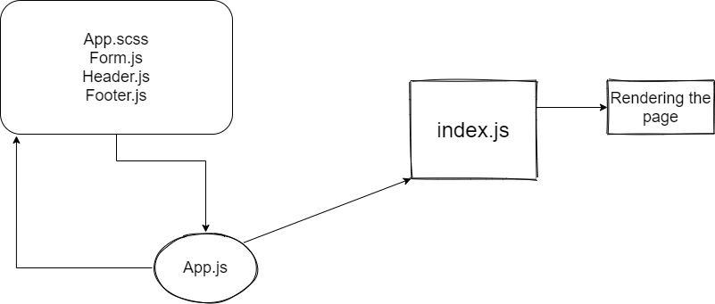

# RESTy
make a connect for two children 

rendering api using fetch

make a pretty jsin using pretty library

# [Netlify](https://6090b0cb4c3abf6fdbb0f2e9--compassionate-meitner-b8af75.netlify.app/)

UML

