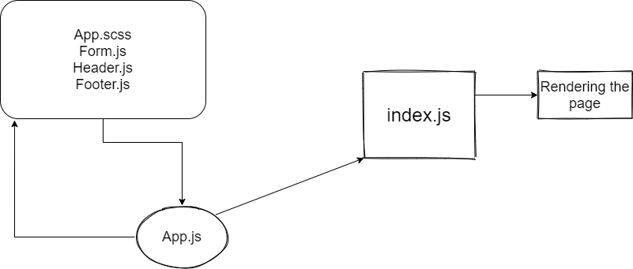

# RESTy
make a repo  

adding React to repo 

install scss package 

make class in form,header,footer folder and export it 

import in app.js and render it in index.js

# [Netlify](https://compassionate-meitner-b8af75.netlify.app/)
 
UML

