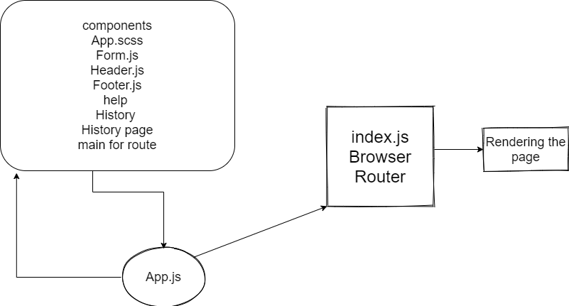

# RESTy
make a history page that display more info for saved data and have a button that switch to home page and fill the form inputs

prevent duplicat the uniqe items

make the help page 

make main component that get all routes

make a collection component that merge form and result components

make a mounting DOM and update Dom to invoke function after rendering the page in the same class

UML

